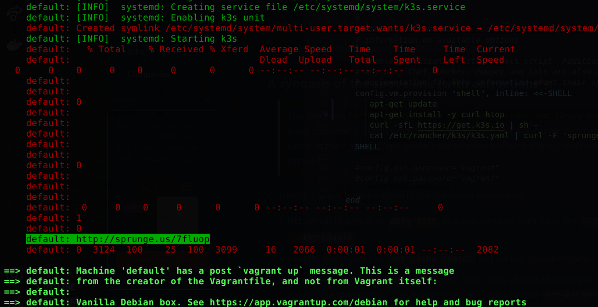
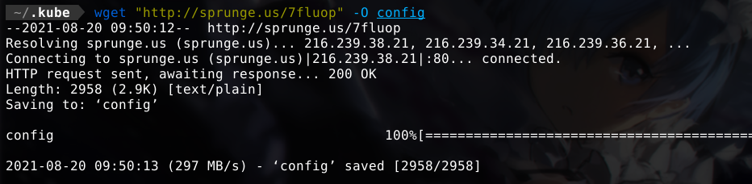
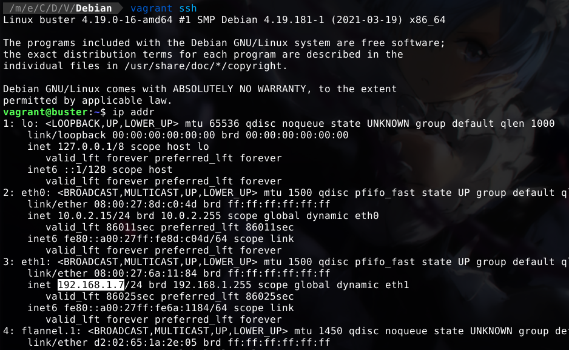
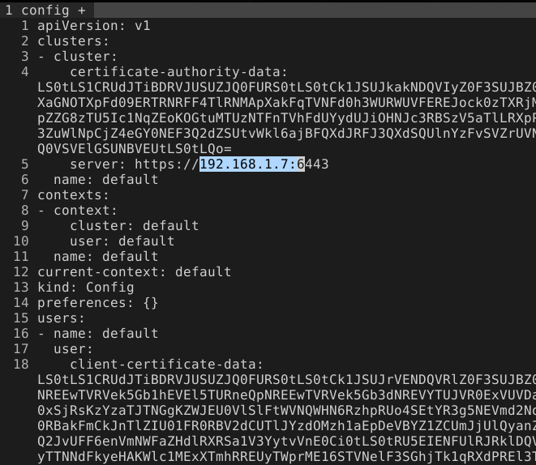
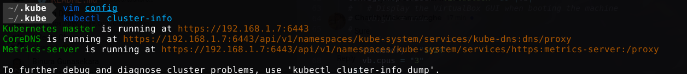

# TryMe

## Vagrant

[Vagrant](https://www.vagrantup.com/) is a single disposable, virtual machine environments in a single workflow.

Create machines

```bash
cd Debian
vagrant up
```

SSH into a running machines

```bash
vagrant ssh
```

Destroy machines

```bash
vagrant destroy
```

## K3s

[K3s](https://k3s.io/) is a lightweight Kubernetes designed for production workloads.

## Set kube config

Copy kube config file to local machine

```bash
cd ~/.kube
mv config config.old
wget http://sprunge.us/<path> -O config
```




Get virtual machine ip address

```bash
ip addr
```





Update kube config's cluster server ip address with virtual machine ip address.

Test config

```bash
kubectl cluster-info
```



## First deployment

Apply `go-puso`

```bash
kubectl apply -f go-puso-cd.yaml
```
